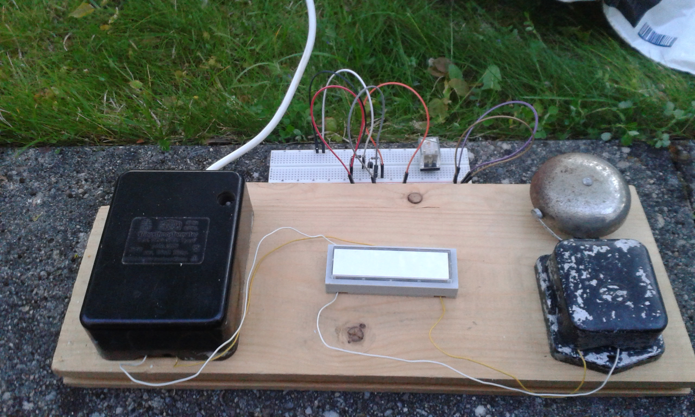

# doorbell

## Benutzung

Die Klingel wird durch das Scannen des QR-Codes betätigt. (Der Link muss im Browser geöffnet werden.)

## SERVER

Um den fertigen Container zu starten folgendes Kommando verwenden:

    docker run -d --name bell -p 8080:8080 -p 8081:8081 jakobbraun/hpi-makerklub-bell 

Um den Container selbst zu erstellen:

    sudo docker build -t jakobbraun/hpi-makerklub-bell .

## Hardware
Neben der ESP Umgebung wird folgende Bibliothek benötigt: https://github.com/morrissinger/ESP8266-Websocket.git
